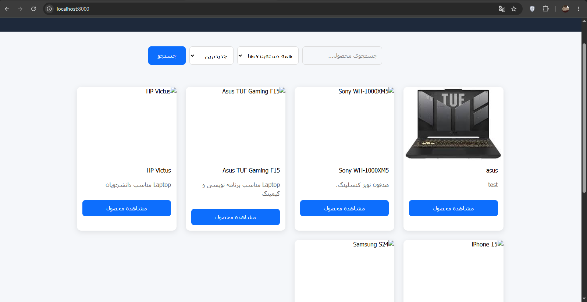
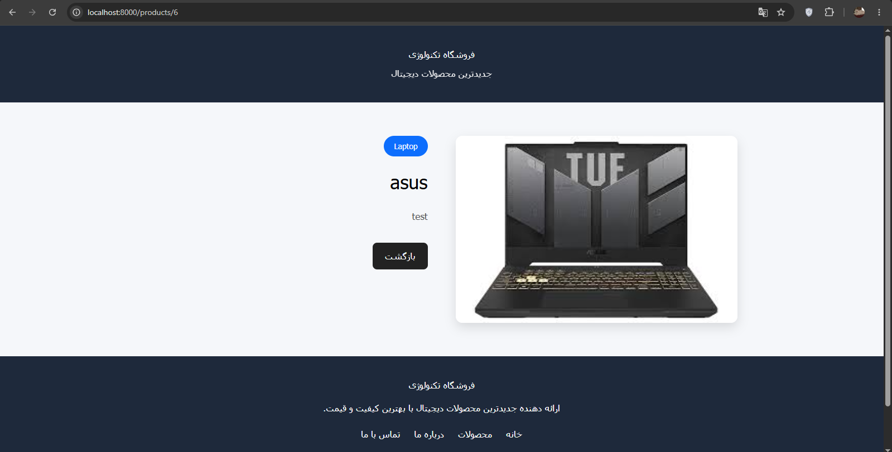
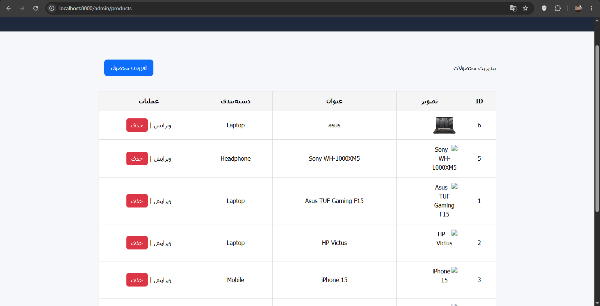
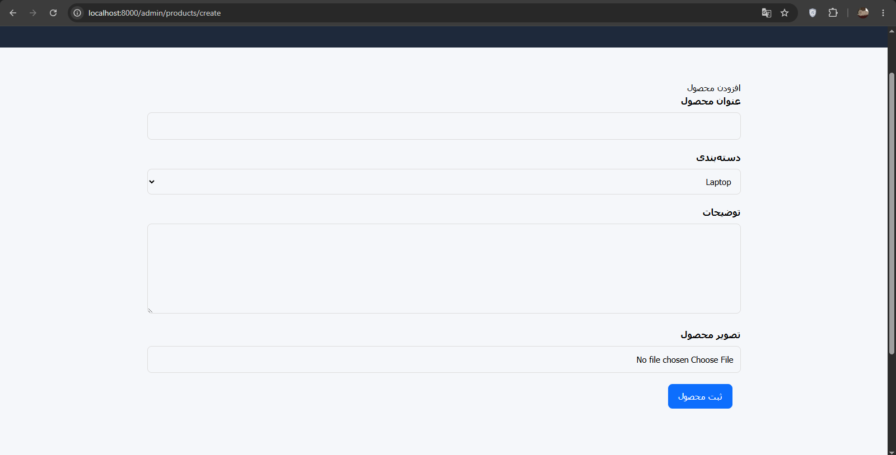
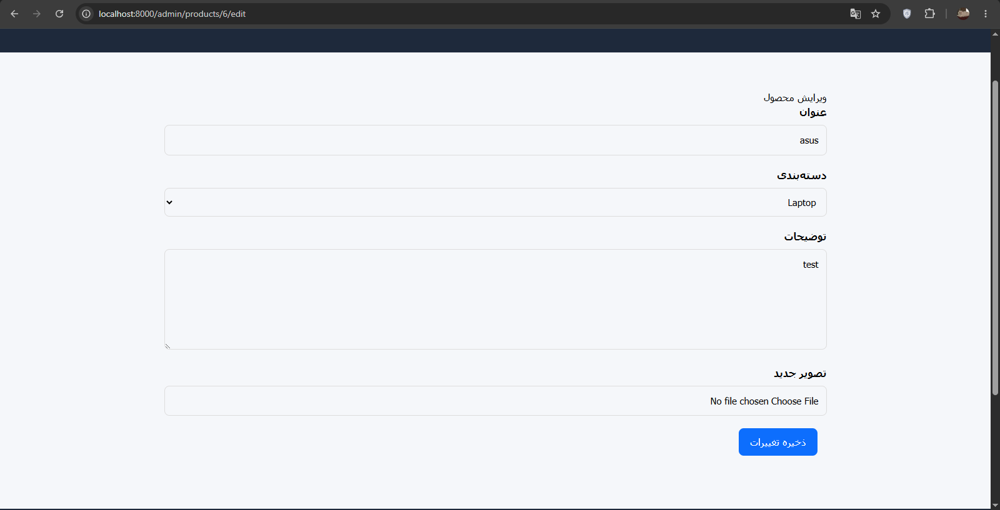

# 🛍️ Product Showcase — Laravel

A full-stack product management and showcase application built with **Laravel 13**, **PHP 8.4**, **MySQL**, **Blade**, and **Tailwind CSS**.

The application provides a public-facing product catalog together with a dedicated admin panel for managing products, categories, images, and user access.

---

## 📌 Project Overview

This project was built as a practical Laravel application to demonstrate real-world backend and web development concepts.

The application follows the MVC architecture and includes authentication, authorization, CRUD operations, server-side validation, image management, database relationships, search, filtering, and pagination.

### 🎯 Project Goals

- Build a structured Laravel application using MVC architecture
- Implement complete CRUD operations
- Manage products and categories through an admin panel
- Implement authentication and authorization
- Handle product image uploads
- Apply server-side validation using Form Requests
- Implement search, filtering, and pagination
- Protect administrative actions using middleware and policies
- Build a clean and responsive user interface
- Practice real-world Laravel development patterns

---

## 📸 Screenshots

### Public Product Showcase

<p align="center">
  
</p>

<p align="center">
  
</p>

### Admin Panel

<p align="center">
  
</p>

<p align="center">
  
</p>

<p align="center">
  
</p>

---
## 📸 Screenshots

### Public Product Showcase

<p align="center">
  
</p>

<p align="center">
  
</p>

### Admin Panel

<p align="center">
  
</p>

<p align="center">
  
</p>

<p align="center">
  
</p>

---

## ✨ Features

### 🛒 Public Product Showcase

- Product listing
- Product detail page
- Product search
- Category filtering
- Pagination
- Responsive design

### 🔐 Authentication & Authorization

- User authentication with Laravel Fortify
- Protected admin routes
- Middleware-based access control
- Policy-based authorization
- Secure administrative actions

### 📦 Product Management

- Create, view, edit, and delete products
- Upload, update, and delete product images
- Product search and filtering
- Pagination

### 🗂️ Category Management

- Create, edit, and delete categories
- Display products by category
- Eloquent relationships between products and categories

### ✅ Validation

- Form Request validation
- Server-side validation
- Validation error handling
- Unique field validation
- Image validation

### 🛡️ Security

- Authentication
- Authorization policies
- Middleware protection
- CSRF protection
- Mass-assignment protection
- Environment-based configuration
- Secure password hashing

---

## 🧰 Tech Stack

### Backend

- PHP 8.4
- Laravel 13
- Laravel Fortify
- MySQL
- Eloquent ORM

### Frontend

- Blade
- Tailwind CSS 4
- Vite
- HTML5
- CSS3
- JavaScript

### Development Tools

- Composer
- NPM
- Git
- GitHub

---

## 🏗️ Architecture

The application follows Laravel's MVC architecture:

```text
app/
├── Http/
│   ├── Controllers/
│   ├── Middleware/
│   └── Requests/
│
├── Models/
│
├── Policies/
│
database/
├── migrations/
└── seeders/

resources/
├── views/
├── css/
└── js/

routes/
└── web.php
```

---

## 🗄️ Database Structure

The main entities in the application are:

```text
Users
  │
  └── Authentication & Authorization

Categories
  │
  └── hasMany
        │
        ▼
     Products
```

### Main Relationships

- A category can have many products.
- Each product belongs to a category.
- Users are authenticated through Laravel's authentication system.

---

## ⚙️ Installation

### 1. Clone the repository

```bash
git clone https://github.com/Mobin0gh/product-showcase-laravel.git
```

### 2. Navigate to the project

```bash
cd product-showcase-laravel
```

### 3. Install PHP dependencies

```bash
composer install
```

### 4. Install frontend dependencies

```bash
npm install
```

### 5. Create the environment file

```bash
cp .env.example .env
```

On Windows PowerShell:

```powershell
Copy-Item .env.example .env
```

### 6. Generate the application key

```bash
php artisan key:generate
```

### 7. Configure the database

Update your `.env` file with your local MySQL database credentials:

```env
DB_CONNECTION=mysql
DB_HOST=127.0.0.1
DB_PORT=3306
DB_DATABASE=example_laravel
DB_USERNAME=root
DB_PASSWORD=
```

### 8. Run migrations

```bash
php artisan migrate
```

### 9. Run seeders

```bash
php artisan db:seed
```

### 10. Create the storage link

```bash
php artisan storage:link
```

### 11. Build frontend assets

```bash
npm run build
```

### 12. Start the development server

```bash
php artisan serve
```

For frontend development with Vite:

```bash
npm run dev
```

---

## 👤 Admin Access

The application includes a protected admin panel.

Admin access is controlled through authentication, middleware, and authorization policies.

For local development, admin/user data can be created through the project's database seeders.

> Do not use production credentials from this repository in a real production environment.

---

## 🧪 Development

Useful Laravel commands:

```bash
php artisan migrate
php artisan migrate:fresh --seed
php artisan db:seed
php artisan storage:link
php artisan route:list
php artisan optimize:clear
```

Frontend:

```bash
npm install
npm run dev
npm run build
```

---

## 📁 Important Project Areas

| Directory | Description |
|---|---|
| `app/Models` | Eloquent models |
| `app/Http/Controllers` | Application controllers |
| `app/Http/Requests` | Form Request validation |
| `app/Http/Middleware` | Route and access middleware |
| `app/Policies` | Authorization policies |
| `database/migrations` | Database structure |
| `database/seeders` | Sample database data |
| `resources/views` | Blade templates |
| `resources/css` | Application styles |
| `resources/js` | Frontend JavaScript |
| `routes/web.php` | Web routes |
| `screenshots` | Project screenshots |

---

## 🚀 Future Improvements

Possible future improvements include:

- RESTful API endpoints
- Automated testing
- Advanced product filtering
- Product image optimization
- Role and permission management
- Dashboard statistics
- API authentication with Laravel Sanctum
- Docker-based development environment
- CI/CD pipeline

---

## 📚 What I Learned

Through this project, I practiced and implemented:

- Laravel MVC architecture
- Eloquent ORM and relationships
- CRUD operations
- Form Request validation
- Authentication with Laravel Fortify
- Middleware
- Policy-based authorization
- File and image uploads
- Search and filtering
- Pagination
- Database migrations and seeders
- Blade templating
- Tailwind CSS
- Vite
- Git and GitHub workflow

---

## 🔗 Repository

GitHub:

https://github.com/Mobin0gh/product-showcase-laravel

---

## 👨‍💻 Author

**Mobin Gholamipour**

Laravel / PHP Developer

GitHub:

https://github.com/Mobin0gh
